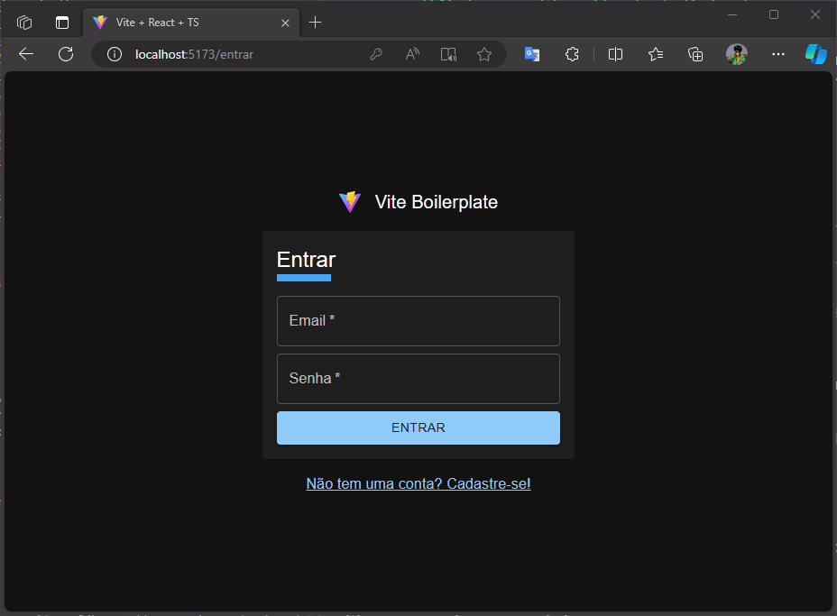
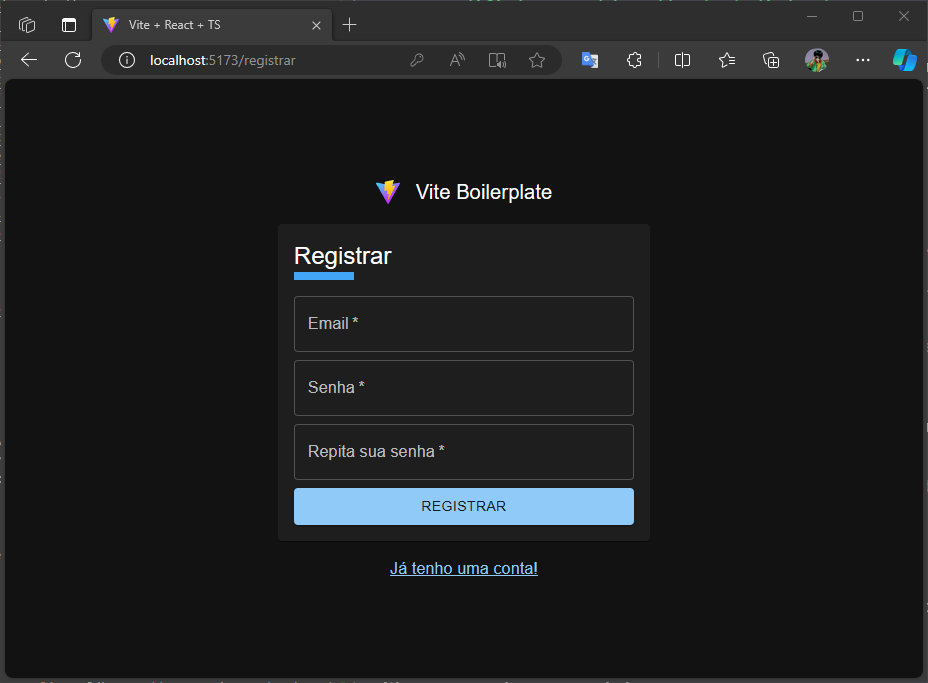
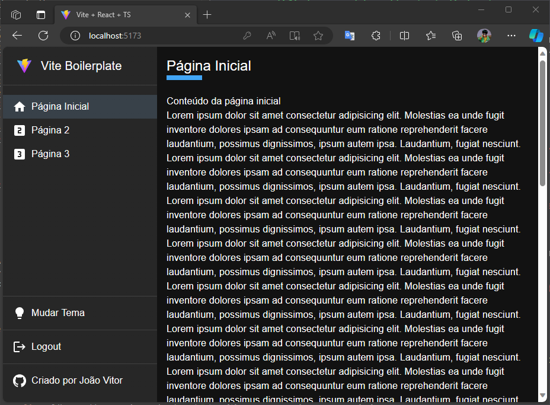
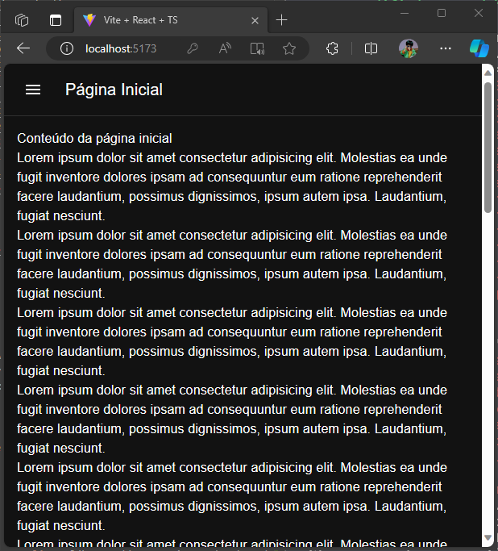

# Vite Boilerplate

This template provides a setup for React development with:

- [React](https://react.dev/)
- [Vite](https://vitejs.dev/)
- [Firebase](https://firebase.google.com/)
- [MUI](https://mui.com/)
- [TypeScript](https://www.typescriptlang.org/)
- [React Query](https://tanstack.com/query/latest)
- [ESLint](https://eslint.org/)
- [Prettier](https://prettier.io/)
- [Husky](https://typicode.github.io/husky/)
- [Jest](https://jestjs.io/)
- [SWC](https://swc.rs/)
- [React Testing Library](https://testing-library.com/)
- [Plop](https://plopjs.com/)
- [GitHub CI](https://github.com/solutions/ci-cd/)

This project contains a responsive layout, login and registration pages using firebase, loading and alerts features, unit tests, route configurations, cli for creating new components, and others resources

## Use This Template

```
npx degit https://github.com/diasjoaovitor/vite-boilerplate your-project
```

## Layout

**Login**



**Register**



**Desktop**



**Mobile**



## Step by Step

create [Vite](https://vitejs.dev/guide/) app

```
yarn create vite
```

```
✔ Project name: … vite-boilerplate
✔ Select a framework: › React
✔ Select a variant: › TypeScript + SWC
```

```
cd vite-boilerplate
yarn
yarn dev
```

---

install [git-commit-msg-linter](https://www.npmjs.com/package/git-commit-msg-linter)

```
yarn add -D git-commit-msg-linter
```

---

create `.editorconfig`

---

configure alias

set options in `ts.config.json`

```json
{
  "baseUrl": ".",
  "paths": {
    "@/*": ["src/*"]
  }
}
```

add module mapper in `jest.config.ts`

```ts
{
  moduleNameMapper: {
    '^@/shared(.*)$': '<rootDir>/src/shared$1'
  }
}
```

and configure in `vite.config.json`

```ts
import { defineConfig } from 'vite'
import react from '@vitejs/plugin-react-swc'
import path from 'path'

// https://vitejs.dev/config/
export default defineConfig({
  plugins: [react()],
  resolve: {
    alias: {
      '@': path.resolve(__dirname, 'src')
    }
  }
})
```

---

install **Prettier - Code formatter** and **ESLint** extension in your VSCode

configure [Prettier](https://prettier.io/docs/en/install)

```
yarn add -D prettier
echo {}> .prettierrc.json
```

edit `.prettierrc.json`

```
yarn prettier src/ --write
```

create `.vscode/settings.json`

install [eslint-config-prettier](https://github.com/prettier/eslint-config-prettier)

```
yarn add -D eslint-config-prettier
```

extend `prettier` in `.eslintrc.json`

---

install [husky and lint-staged](https://prettier.io/docs/en/install#eslint-and-other-linters)

```
yarn add -D husky lint-staged
```

configure [Husky](https://typicode.github.io/husky/getting-started.html)

```
npx husky-init && yarn
```

create `.lintstagedrc.ts`

change command to run _lint-staged_ in `.husky/pre-commit.sh`

---

configure [Jest](https://jestjs.io/docs/getting-started) and [SWC](https://swc.rs/docs/getting-started)

```
yarn add -D jest @types/jest jest-environment-jsdom ts-node @swc/core @swc/jest
```

install [react testing library](https://testing-library.com/docs/react-testing-library/intro/), [jest-dom](https://github.com/testing-library/jest-dom) and [jest-fetch-mock](https://github.com/jefflau/jest-fetch-mock#readme)

```
yarn add -D @testing-library/react @testing-library/user-event @testing-library/jest-dom jest-fetch-mock
```

create `jest.config.ts`

create `.jest/setup.ts`

import libraries in `.jest/setup.ts`

include `.jest/setup.ts` in `tsconfig.json`

```json
{
  "include": [".jest/setup.ts"]
}
```

add scripts

```json
{
  "scripts": {
    "test": "jest",
    "test:watch": "jest --watchAll",
    "test:ci": "jest --runInBand"
  }
}
```

---

install [MUI](https://mui.com/material-ui/getting-started/installation/)

```
yarn add @mui/material @emotion/react @emotion/styled @mui/icons-material
```

---

install [Plop](https://plopjs.com/documentation/)

```
yarn add -D plop
```

create `generators/plopfile.js` and create `templates`

create `script` in `package.json`

```json
{
  "scripts": {
    "generate": "yarn --no plop --plopfile generators/plopfile.js"
  }
}
```

```
yarn generate layout
```

---

create `.github/workflows/ci.yml`

---

configure pages with [react-router-dom](https://reactrouter.com/en/main)

```
yarn add react-router-dom
```

create `pages/Home` and create `Router.tsx`

import `Router.tsx` in `App.tsx`

---

configure **Theme**

create themes in `shared/themes`

create `ThemeContext`

encapsule `Router` in `App.tsx`

```tsx
function App() {
  return (
    <ThemeProvider>
      <Router />
    </ThemeProvider>
  )
}
```

---

install [firebase](https://firebase.google.com/docs/web/setup?hl=pt-br)

```
yarn add firebase
```

create `.env` and `shared/firebase/config.ts`

create `shared/contexts/AuthContext`

implements `PrivateRoute` in `Router.tsx`

implements `AuthProvider` in `App.tsx`

---

install [React Query](https://tanstack.com/query/latest/docs/react/installation)

```
yarn add @tanstack/react-query
```

implements `QueryClientProvider` in `App.tsx`

---

install Firebase CLI

```
sudo npm install -g firebase-tools
```

implements Firebase Hosting

```
firebase login
```

```
firebase init
```

```
firebase deploy
```

configure vite to use `process.env` instead of `import.meta` in `vite.config.ts`

```ts
export default defineConfig((props) => {
  const env = loadEnv(props.mode, process.cwd(), 'VITE')
  const envWithProcessPrefix = {
    'process.env': `${JSON.stringify(env)}`
  }
  return {
    plugins: [react()],
    define: envWithProcessPrefix,
    resolve: {
      alias: {
        '@': path.resolve(__dirname, 'src')
      }
    }
  }
})
```

this setting fixes the error `SyntaxError: Cannot use 'import.meta' outside a module` when running unit tests

also, the environment variables require a string as an alternative value to fix the error `Firebase: Error (auth/invalid-api-key)`

```ts
const app = initializeApp({
  apiKey: process.env.VITE_API_KEY || 'string',
  authDomain: process.env.VITE_AUTH_DOMAIN || 'string',
  databaseURL: process.env.VITE_DATABASE_URL || 'string',
  projectId: process.env.VITE_PROJECT_ID || 'string',
  storageBucket: process.env.VITE_STORAGE_BUCKET || 'string',
  messagingSenderId: process.env.VITE_MESSAGING_SENDER_ID || 'string',
  appId: process.env.VITE_APP_ID || 'string'
})
```
